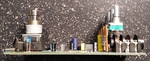
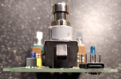
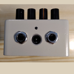
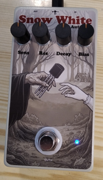
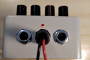
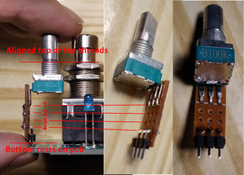
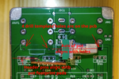
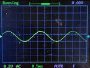
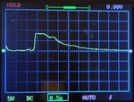

# pedal-snow-white-autowah
Snow White AutoWah (envelope filter) guitar pedal in 125B enclosure using layout without offboard-wiring

# Features

- 125B enclosure
- Top mounted jacks
- Center-negative DC barrel jack
- Perfect pedal layout:
    - one big pcb
    - no offboard wiring
    - easy insertion into enclosure
    - easy testing outside of enclosure (including pots and stomp switch!)
- Included:
    - KiCad 7 project (schematic, PCB, pot daugterboards)
    - Gerber files
    - Artwork

# Schematic

# PCB

# Photos

## PCB

## Enclosure

# Build instructions

- Visually check PCB for defects
- Chect for short on tip and sleeve pins of JDC1
- Power section
    - Solder GND wire loop connector (0.5~0.8mm tined copper wire) in top-right corner, it is used for crocodile clip on negative lead of multimeter
    - Solder JDC1 barrel jack connector and measure 9V on R96 pads against ground (note that this PCB uses center negative 9V DC connector)
    - Solder R96 10R (values 0-47R are ok, expected load is 15mA so voltage drop is R*0.015, e.g. 10R = 0.15V drop (from 9V), 47R=0.47V)
    - Polarity protection
        - Solder Q99 AO3401, marking A19T (P-ch mosfet)
        - Solder ZD99 9.1V zenner BZT52B9V1S, marking 2WE (any zenner from 3-12V can be used), line is cathode = tip of the white triangle
        - Solder R99 10k (some recommend 100k, with 10k reverse transient is shorter and smaller, but forward current draw is higher, depending on zener)
        - Test polarity protection
            - Connect regulated power supply via JDC1. Use one ammeter (in series) and one voltmeter (negative lead to GND loop testpoint, positive lead to + pin of LED D99)
            - Start at 0V and slowly rise the voltage to 9V, the voltage on D99 should closely follow the input voltage.
                 Current should be small as there is no load, few microamps.
                 Depenging on your zener it can be up to Vin/R99, e.g. at 9V/10k=900uA, mine was 400uA with 10k R99
            - Return to 0V and raise negative voltage to -9V. Output should be 0V (I have -0.07V, probably leakage of zener diode, mosfet and voltmeter itself).
            - When you try positive voltage now it should still works.
    - In front of the JDC1 there are 2 holes, you can solder 0.5mm tined copper wire loop across and over the top of the JDC1 connector to reduce the side-to-side strain
    - Solder "Power on" red LED D99 and it's current limiting resistor R98 (4k7).
    - Power it via ammeter (consumption could be 1.5mA), test point +9V (next to C99) should have approx. 9V
    - Power it with reverse polarity, current should be zero, voltage should be near zero, led should be off, reconnect normally and it should work again
    - Solder blue D98 led and it's resistor R97 22k
    - Solder C99 electrolytic cap
- True bypass
    - Cut 0.3mm of the plastic from the front left corner of the JOUT1 and front right corner of the JIN1 jacks
    - Solder JIN, JOUT jacks, make sure of 4 things:
        - Cut corners are on the outside
        - Holes are in front
        - Jacks are on top side
        - They are well seated
    - Solder main 3P2T switch (on top side, well seated)
    - Test with guitar and power on, when effect is off it should work as true bypass, when the effect is off you should not hear anything.
        Or use continuity tester, when efect is on, JIN shorts to IN, JOUT shorts to OUT.
        When effect is off JIN shorts to JOUT and IN shorts to ground
- Solder JGND1 and test if it goes easily into enclosure, but still should be touching it, making contact, bend the contact more/less to adjust the force.
- If you ever plan to use internal battery (or sell the pedal), solder U99 JST-XH connector and test it now. The power on led will only shine if the input audio mono jack is in.
  When you connect DC barrel jack the battery should be disconnected automatically. Battery connector is also reverse polarity protected.
- Drill the enclosure, Use spare pcb to mark where the holes will be.
    - 12.7mm hole for main 3PDT switch
- Solder 4 pots on their adapter boards. Before you solder them make sure that 3PDT switch have enough thread for given pot height.

    

    Note: I designed this before I knew actual height of everything so I had to make daughterboards from perfboard,
            but you can now use real PCB daugterboards: [kicad_pot_daugterboard/](kicad_pot_daugterboard/).
            The key issue to keep in mind is that the daugterboard is so tall that the top of the pot thread
            aligns with the top of the switch threads when the pot daughterboard is resting on the pcb.
            In my case, for my pots, it was exactly 4 holes on the perfboard.
            Make 4 identical daugterboards for the 4 pots but don't solder them yet into the pcb.
- Drill four 8mm holes for the pots.
    On the PCB there are 4 tiny non-plated through holes (NPTH) that are aligned with the axle of the pot, you can use this holes as a drill teplate for the enclosure.
    When you put pot with daugterboard on the side atop of the pcb you can see that the drill template holes are aligned with the pot axle, and that the pin header pins are
    aligned with the pot footprint holes where it will be then soldered.

    

    - Tape spare pcb to the top, use tiny NPTH holes to pre-drill with 1mm drill, then drill with 8mm drill for the pots (use do it in two steps, drill 4mm then 8mm)
    - Snip off the dimple in front of each pot (with side-cut pliers)
    - Insert PCB with all 4 pot daughterboards into enclosure, tighten 4 pot nuts and also tighten main switch nut (from the bottom use other nut as a stopper),
      then solder pot daugterboards into the pcb, this will be their final position be accurate
- Drill 10mm holes for 2 audio jacks (there are two holes marging center of axis of jacks, one is marked 17.72 which is distance from bottom of enclosure)
- Drill 10mm hole for DC barrel jack (simply 15.5mm from the bottom in the center)
- Drill 1 or 2 holes for light pipes (mine were 2.3mm, your may be different)
- Test the insertion into enclosure. Make the inserting as smooth and easy as possible at this stage so that you don't damage finished pedal later.
    The insertion should be effortless, everything should align and match perfectly (except for jgnd1 there should be a bit of friction).
- Virtual ground
    - solder C14 and measure 9V on it
    - solder R9, R10, C3, C4
    - measure that C3 has approximately 4.5V
    - measure power consumption of entire pedal with effect on (1.99mA at 9.00V)
    - put on ESD strap from now on
    - solder U2 opamp and measure that VG test point have approximately 4.5V
    - measure power consumption again, difference is the consumption of 1 opamp (3.13mA at 9.00V = 1.14mA per amplifier @9V)
    - load VG with 10k to ground and voltage should not drop too much (4.5 to maybe 4.49, the divider itself is not regulated so ...)
    - Measure +4.5V on every single opamp (U3, U6, U7) pin 3
    - Cleanup flux and check 4.5V on VG test point again
- Input buffer
    - With effect on, use audio probe to check that audio signal is on the IN testpoint
    - Measure 4.5V on R6 (upper pad)
    - Solder R1 and C19 and measure 9V on C19 (right pad)
    - Solder R4, R5, R6, R7, C2
    - Check that gate still has audio signal
    - Solder Q2 JFET
    - With effect on check audio on BUF test point, you should hear audio
    - Solder temporary wire between BUF and OUT test points, test pedal, it should now work as JFET buffer,
        when ON it should be brighter, with low impedance input on the pedal output (e.g. PC sound card mic input which has impedance approx. 1700 ohm)
        the difference should be significant, muddy with bypass, bright with effect on.
    - Remove the BUF-OUT temporary wire
    - Clean up the flux and check audio on BUF testpoint
- Sensitivity (extra gain stage for envelope detector)
    - Solder C1 and check 9V on it
    - Measure 4.5V on pin 3 of the opamp footprint
    - Measure good audio signal on left pin of C6
    - Solder C6, R11, C7
    - With Sensitivity pot in any position, you should hear audio on SEN test point (it is still in series so it doesn't work as voltage divider and doesn't attenuate)
    - make sure you still wearing esd strap
    - Solder opamp U3
    - Check audio on SEN test point, sensitivity pot should now be able to adjust volume from 0 to 5x louder
    - Measure power consumption (4.9mA)
    - Clean up the flux and check SEN test point and pot again
- Envelope detector
    - rotate SENS pot in the middle and check good audio on EDIN test point
    - Solder C18 and measure 9V on it
    - Solder R12 R13 D4 D5 and U6 opamp
    - When playing sinewave you should see bottom half of the sinewave on the test point ED1
        - Sinewave at EDIN

        

        - Signal at ED1 testpoint

        

    - Solder R14 and R17, ED1 (and top pin of C8) will now have saggy bottom signal:

        

    - Solder C15 and measure 9V on it
    - Solder R15 R16 C8 and U7 opamp
    - Measure consumption (6.6mA)
    - When you play simple strums, ED2 test point should already show envelope (lower the timebase of scope to see the envelope)
        Here is 3-strings strum decaying over 4s or so. Sensitivity to 11 o-clock. Amplitude is virtually full scale from 0 to almost 9V.

        

- Decay speed
    - Solder R18 D6 R19 C9
    - Testpoint DEC will show same envelope as ED2, but the decay will be slower or faster depending on the Decay pot position
        Note: Easiest way to test decay is use 1s sinewave, 3s silence. Then you clearly see fast decay at 0% and several second long decay on 100%.
- +5V regulator
    - Measure consumption (6.65mA)
    - Solder C17 and verify 9V on it
    - Solder C5 D3 and U4 regulator
    - verify +5V on the +5V test point
    - Measure consumption (9.60mA)
- Bias
    - Solder C20 and check +5V on it
    - Solder Q3, Q4, R21, R20
    - Testing this part is bit more difficult, you can leave it untested.
- Voltage controlled filter
    - Solder C16, C21 and measure 9V on it
    - Measure consumption (9.68mA)
    - Solder C10, C13, R22, R23, R24, R27, R31, R25, R26, R28, R32, R33
    - Measure consumption (10.54mA)
    - Without input singal and with pots at 12-o'clock measure pin voltages of LM13700 footprint (LM13700 not yet soldered, just a doublechceck)
        Pin1 = 5V (top left)
        Pin2 = 0V
        Pin3 = 4.5V
        Pin4 = 4.31V
        Pin5 = 0V
        Pin6 = 0V
        Pin7 = 0V
        Pin8 = 2.34V (bottom left)
        Pin9 = 2.15V (bottom right)
        Pin10 = 0V
        Pin11 = 9V
        Pin12 = 0V
        Pin13 = 4.5V
        Pin14 = 4.34V
        Pin15 = 0V
        Pin16 = 5V (top right)
    - Solder LM13700
    - Solder C11, C12
    - Measure consumption (12.2mA)
    - Pedal should now be completed and work
- Final testing
    - Put pedal in enclosure and do final test of the pedal

### Support

You can support development on [Patreon](https://www.patreon.com/DusanHalicky) or you can hire me via [Upwork](https://www.upwork.com/freelancers/~013b4c3d6e772fdb01)

